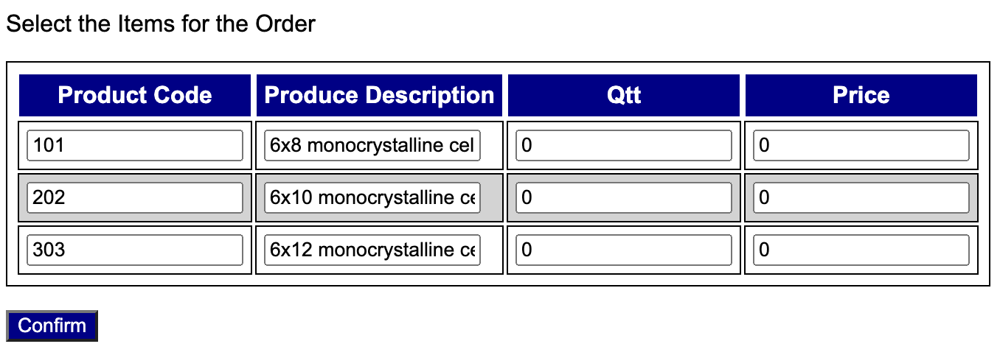

[](https://classroom.github.com/a/PlJB6hPs)
# Overview

**Sol Systems** is a medium-sized company specializing in the sale of solar panels. The company wants to simplify the process by which customers enter new purchase orders. Your team has been hired to implement a web application that meets the requirements outlined in this document. Given that these requirements are well understood and the project size is relatively small, your team has decided that the **waterfall** process model is appropriate for this project. Following the **waterfall** process model, the phases of this project are described in more detail below.


Sol Systems Logo

# Communication Phase

## Overview

The project consists of building a web application that allows Sol Systems customers to place new orders for solar panels. The web application will simplify the way orders are placed and, consequently, increase the company's revenue.

## Objectives 

* Simplify how orders are placed.
* Manage and track orders.
* Maintain the products catalog.

## Features 

1. Users (customers and administrators) **must** be able to authenticate themselves. 
2. Customer users **must** be able to place new orders through the platform.
3. Customer user **must** be able to track their own orders. 
4. Administrator users **must** be able to change the status of any order. 
5. Administrator users **should** be able to update the products catalog. 

## Contraints 

* A working version with all required functionalities (the ones specified with a **must**) is expected to be delivered in 3 weeks. 
* The implementation team **must** have from 3 to 5 members (no exception). 
* The software **must** be implemented in **Python**, **Flask**, and **SQLAlchemy**. 

## Risks 

* The tight schedule may result in the system not meeting quality requirements. 

## Assumptions 

* **Sol Systems** will provide the current products catalog for the initial database load. 
* **Sol Systems** will also provide a list of admininstrator users for the initial database load. 

# Planning Phase

## Schedule 

Estimate a schedule for this project by completing the table below. 

|Phase|Task|Start|End|Duration|Deliverable|
|---|---|---|---|---|---|
|Modeling|Requirements Analysis|mm/dd/23|mm/dd/23|99 days|Use Case Diagram|
|Modeling|Data Model|mm/dd/23|mm/dd/23|99 days|Class Diagram|
|Construction|Coding|mm/dd/23|mm/dd/23|99 days|Code|
|Construction|Testing|mm/dd/23|mm/dd/23|99 days|Test Report|
|Deployment|Delivery|mm/dd/23|mm/dd/23|99 days|Final Commit/Push|

## Team Roles

Assign roles for each member of the team by completing the table below. Member can take more than one role. 

|Name|Role(s)|
|--|--|
|name|manager,developer,tester,documenter|

# Modeling Phase

## Requirements Analysis 

Based on the description given for this project, complete the requirements analysis by building a use case diagram using UML.  

## Data Model 

Based on the description given for this project, complete the data modeling by building a class diagram using UML. At a minimum, your data model must include the following entities (with the attributes listed):

* User: id, name, password, creation date (automatically assigned upon sign-up). 
* Customer User: address, phone, credit card info (number, expiration date, and code). 
* Administrator User (same as user)
* Product: code, description, availability (true/false), (suggested) price
* Order: number, creation date (automatically set upon placing order), items, status (new, accepted, delivered, completed)
* Item: sequential number, quantity, and (paid) price

## Baseline Implementation

Baseline your app in **Flask** so that users can authenticate and navigate to all pages, but using fake (encoded) data. This will allow page design to be done before actual implementation.

You **must** use the following structure to organize your project. 

```
.venv
pics
|__pic1.png
|__pic2.png
src
|__app
|__instance
|__static
|__templates
uml
|__class.wsd
|__use_case.wsd
README.md
requirements.txt
Dockerfile
```

# Implementation Phase

**STOP!** Do not start implementation before presenting to your instructor what you have done so far in terms of modeling. This is a mandatory checkpoint of your project.

At this point in our course you have not yet received further instructions on how to divide tasks and work cooperatively in a team. However, you learned how to create git branches and resolve merge conflicts. As a suggestion, create a **dev** branch for the **beta** versions of your project. Additionally, create (local) temporary branches for development/test assigned to individual team members.

# Testing Phase

At this point you are NOT expected to write automated tests.  Instead, you are asked to run manual tests and complete a report using the table below. 

|Functionality Tested|Date|Time|Result|
|--|--|--|--|
|Sign Up|99/99/23|99:99|passed|

# Deployment Phase

Commit and push your project using "final submission" as the commit message. You should also create a Docker image that would allow the instructor to run your project as a container. For that requirement, you should create a Dockerfile that allows the instructor to create the image of your project and from that image to run your project as a container. 

# Team Evaluation 

Each of your will receive a form to evaluate the members of your team and to self-evaluate yourself.  

# Rubric 

+5 Planning: Schedule

+5 Planning: Team Roles 

+10 Modeling: Use Case Diagram 

+10 Modeling: Class Diagram

+10 Check-point

+40 Implementation

+10 Testing 

+10 Deployment

-25 Team/Self Evaluation

## Bonus

+5 updated the products catalog (feature #5)

+5 administrator users can update the products catalog (add new products and change the availability of a product or its price)

# Miscelaneous 

To facilitate grading, please add the following admin user: { 'id'='tmota', 'passwd'='1' }.

Also, add the following products: 

```
[
    {   'code': 101, 
        'description': '6x8 monocrystalline cell panel, 240W', 
        'available': true, 
        'price': 150.00
    },
    {   'code': 202, 
        'description': '6x10 monocrystalline cell panel, 310W', 
        'available': true, 
        'price': 300.00
    },
    {   'code': 303, 
        'description': '6x12 monocrystalline cell panel, 400W', 
        'available': true, 
        'price': 450.00
    }
]
```

When I implemented my solution, I used Flask WTF's **FieldList** and **FormField** to build the form to place orders. **FieldList** allowed me to create a form with repetitive input fields, as depicted below. 


